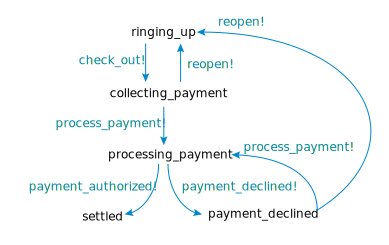
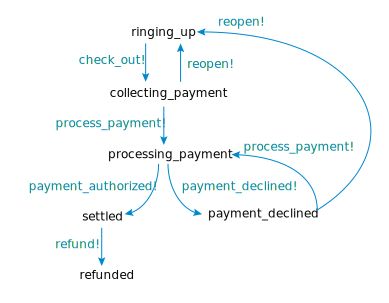

# State Machine Exercise

## Getting oriented and set up

This project depends on several third-party libraries, which Ruby calls “[gems](https://rubygems.org).” Like most Ruby projects, this project uses [Bundler](http://bundler.io) to manage its gem dependencies and their versions. Together, Gems and Bundler are a “package manager.” (You may be familiar with other package managers: pip in Python and npm in Javascript. Both of those are based on RubyGems and Bundler.)

Take a look at `Gemfile`. It specifies which gems this project depends on, where to install them from, and optionally constraints on which version of the gem to use. (Note that `Gemfile` is itself Ruby code!)

Now take a look at `Gemfile.lock`. It specifies which gems bundler actually installed (including indirect dependencies not listed in the gemfile), where bundler got the gems from, and which exact version it installed. Checking this file into git helps ensure that an entire development team is using the same version of all the dependencies, and we don’t get into the situation where the code works for some people but not others.

To install the gems listed in `Gemfile`:

```bash
gem install bundler  # in case you don’t already have it
bundle install       # or you can just type `bundle`
```

Now test your installation:

```bash
bundle exec rake test
```

(The `bundle exec` prefix ensures that Ruby is using the exact version of each gem specified in `Gemfile.lock`. `rake` is a utility for running tasks from the command line. Common uses include running tests, setting up databases, creating test data, etc.)

The tests should run with some skips, but no failures or errors. Look for this at the end of the test output:

```bash
19 runs, 30 assertions, 0 failures, 0 errors, 0 skips
```

If you see that, you’re up and running.


## Reading the existing code

This problem asks you to do a lot of code reading, and a little code writing.

In `lib/retail_transaction.rb`, you will find a rudimentary model of a sale on a point of sale system (or “cash register” as we normal humans call it). This class uses a gem called [Acts As State Machine](https://github.com/aasm/aasm) (“AASM” for short) to model the different states a transaction can be in:



Note how the `aasm` section in the code looks as if Ruby has some kind of built-in handling for states and events and transition rules. It doesn’t. The aasm gem added that.

Now take a look at `test/retail_transation_test.rb`. These tests describe all the expected behavior of a retail transaction in its various states. Things to note:

- Each `it` block is a single test.
- Each test takes an action or creates a paricular situation, then makes assertions about it.
- The `let` block at the top creates a transaction we can use for testing. It is named `tx`. That `let` block runs over and over, once for each individual test, so each test begins with the same empty transaction. This is important: it means the tests do not depend on each other, so we can run them individually or in any order.
- The `describe` blocks group logically related tests.
- The `before` blocks run once before _each_ individual test within their group. They set up a state that all tests within the group share.

(All of this is the [minitest/spec](https://github.com/seattlerb/minitest#specs) library if you want more documentation, though I think the best way to understand the structure is to read it.)

Note that these tests use methods that `RetailTransaction` does not actually declare. AASM generates them using metaprogramming. Some test whether the object is in a particular state, e.g.`ringing_up?`. Some trigger a state transition event, e.g. `payment_authorized!`. There are many others the tests do not use, such as ones that test whether a given state transition is allowed, e.g. `may_refund?`.


## Your task

Your task is to add and test a new `refunded` state and `refund` event, so that the state diagram now looks like this:



Adding the new state and new event will be easy; adding tests will be a little more tricky. Some hints:

- Add a new test that ensures a settled order can be refunded.
- Add tests to one or two other states that ensure they _cannot_ be refunded. (You don't need to add that to _every_ other state. Unit testing is all about picking good examples, not about explicitly making every possible scenario happen. Which states might another programmer carelessly assume would allow refunding? Test those.)
- Add a new `describe` group for orders that are already refunded.
- Test that transactions cannot be refunded a second time.
- Test that a refunded order cannot be reopened.
